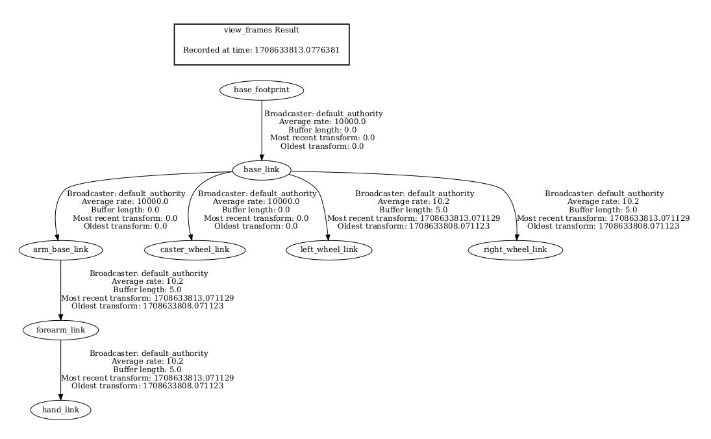

# ROS2 & Gazebo and Rviz First Project: Add a robotic arm on top the robot


## What I learned?
    - TF introduction
    - Create URDF with links and joints
    - Robot description package with config and launch file
    - Improve URDF with Xacro - properties, macros
    - Add inertial and collision tags in URDF
    - Gazebo plugins
    - Spawn the robot in Gazebo
    - Robot bringup package with Gazebo launch file
    - Create a world with objects and walls
    - Add a sensor to the robot

### Links


### move robot bash code
```bash
ros2 topic pub /cmd_vel geometry_msgs/msg/Twist "{linear: {x: 0.5}, angular: {z: 0}}"
```
### move the robot's arm bash code
```bash
ros2 topic pub -1 /set_joint_trajectory trajectory_msgs/msg/JointTrajectory '{header:
{frame_id: base_footprint}, joint_names: [arm_base_forearm_joint, forearm_hand_joint],
points: [ {positions: {0.3, 0.5}} ]}'
```